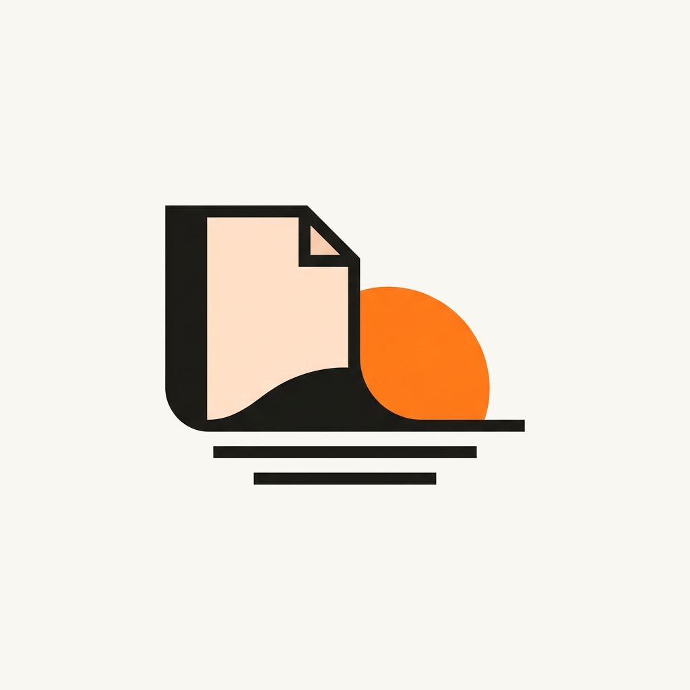
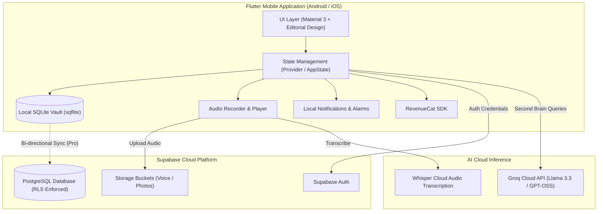

# Dusk — Private Daily Dump & Guided Reflection Ritual

<div align="center">



### *Turn your chaotic daily mental dumps into calm, structured reflection rituals and actionable second-brain insights.*

[](https://flutter.dev)
[](https://dart.dev)
[](https://supabase.com)
[](https://www.revenuecat.com)
[](https://groq.com)
[](#-shipathon--devpost-submission-overview)

[**Devpost Overview**](#-shipathon--devpost-submission-overview) • [**Features & Functionality**](#-app-features--functionality) • [**Demo Video**](#-demo-video) • [**Testing Premium for Judges**](#-unlocking-premium-features-for-judges) • [**Screenshots & Assets**](#-app-assets--screenshots) • [**Architecture**](#-technical-architecture--tech-stack) • [**Getting Started**](#-getting-started--local-setup)

</div>

---

## 🏆 Shipathon & Devpost Submission Overview

This submission is tailored for the **Next Gen Student Track** of Shipathon 2026. 

| Submission Requirement | Status | Project Evidence / Location |
|---|---|---|
| **Text Description of Features & Functionality** | ✅ Included | [Features & Functionality](#-app-features--functionality) |
| **Demo Video (< 2 minutes, on-device footage)** | ✅ Included | [Demo Video & Timestamps](#-demo-video) (Public YouTube/Vimeo link) |
| **1024×1024 App Icon** | ✅ Included | [`assets/icons/dusk_icon_1024.png`](assets/icons/dusk_icon_1024.png) |
| **Frameless Screenshot (1179px × 2556px)** | ✅ Included | [Screenshots Gallery](#-app-assets--screenshots) (`DuskMockups/`) |
| **Free Trial / Judge Promo Unlock for In-App Purchase** | ✅ Included | Built-in **1-Tap Tester Override** on Paywall screen + RevenueCat Sandbox ([Judge Unlock Guide](#-unlocking-premium-features-for-judges)) |
| **App Store / Google Play URL** | ℹ️ Exempt | **Next Gen Student Track** (Full source code, reproducible build, & APK instructions provided) |

---

## 💡 The Problem & Inspiration

Throughout each day, our minds overflow with fleeting thoughts, to-do lists, voice memos, quick snapshots, and half-formed ideas. We capture them randomly: notes apps, self-messages on messaging apps, voice clips, and screenshots. 

**The result? Mental fragmentation.** 
- Captures are scattered and quickly forgotten.
- Traditional journaling feels like an intimidating chore after a tiring day.
- Habit trackers push guilt-inducing streaks and gamification rather than true mental clarity.

### The Dusk Solution: The Intentional Loop
Dusk provides a calm, private sanctuary that closes the loop on raw mental data without pressure:

```
┌──────────────┐      ┌────────────────────┐      ┌────────────────────────┐      ┌──────────────────────┐
│ 1. CAPTURE   │ ───► │ 2. RECALL          │ ───► │ 3. REFLECT             │ ───► │ 4. UNDERSTAND        │
│ Quick text,  │      │ Review captures at │      │ Answer 4–6 tailored    │      │ Editorial Insight    │
│ voice, photo │      │ chosen cadence     │      │ personalized questions │      │ Card + Dusk Buddy AI │
└──────────────┘      └────────────────────┘      └────────────────────────┘      └──────────────────────┘
```

---

## ✨ App Features & Functionality

### 1. ⚡ Frictionless Multimodal Raw Capture
Capture in the moment without getting bogged down by structure, folders, or metadata:
- **Stream-of-Consciousness Thoughts**: Ultra-fast text capture with intelligent automatic tag suggestions.
- **Fluid Voice Memos**: Native high-fidelity audio recording with live animated waveforms, local caching, and automatic transcription.
- **Visual Moments (Photos)**: Snap photos or select memories directly from your gallery to anchor ideas visually.
- **Flexible Spaces / Projects**: Group captures naturally by workspace contexts (e.g., *Personal*, *Work*, *Creative*, *Life*) without cognitive overhead.

### 2. 🌅 Evening Reflection Ritual & Calm Cadence
Reflection shouldn't feel like homework; it should feel like an intentional, peaceful transition:
- **Personalized Cadence**: Configure reflection cycles that fit your lifestyle — **Daily**, **Every 2–3 Days**, or **Weekly**.
- **Ambient Chimes & Mindful Alarms**: Gentle, warm reminder sounds (*Singing Bowl*, *Calm Horizon*, *Evening Chime*) that invite reflection rather than jarring alerts.
- **Guided Reflection Session**:
  - Automatically synthesizes all text notes, voice memos, and moments recorded during the active cycle.
  - Generates **4–6 personalized reflection questions** tailored specifically to what you actually experienced and captured during that cycle.
  - Respond flexibly via voice recording or text typing.

### 3. 🎨 Editorial-Grade "Insight Cards"
At the conclusion of each reflection ritual, Dusk’s synthesis engine generates an **Insight Card**:
- Highlights key breakthroughs, shifts in perspective, and underlying emotional patterns.
- Identifies recurring themes across personal and professional spaces.
- Offers gentle, non-judgmental next steps for the upcoming cycle.
- Formatted as an editorial, collectible card that can be saved to your archive or exported.

### 4. 🧠 Dusk Buddy — Private Second-Brain AI Companion
Dusk Buddy turns past captures into an active, conversational second brain:
- **Strictly Grounded Retrieval**: Answers questions solely based on your personal dump history, pending tasks, and reflection archives.
- **Zero Hallucination Guardrails**: Adheres strictly to vault boundaries — if information is missing from your personal notes, Dusk Buddy explicitly confirms: *"Sorry, nothing like that in your second brain."*
- **Blazing Fast AI Inference**: Powered by the Groq Cloud API for near-instant responses using advanced open models (`openai/gpt-oss-120b`, `llama-3.3-70b-versatile`).
- **Rotating Gradient AI Button**: Embedded snugly above the navigation bar with continuous fluid gradient rotation animations.
- **Home Screen Quick Widget**: A 1×1 clean, transparent launcher widget configured via **Settings → Home Screen Widgets** for instant 1-tap capture or AI chat.
- **Modern Input Composer**: Fluid expandable multi-line input, live character counter, quick clear button, and subtle haptic feedback.

### 5. ✅ Smart Task Vault & Organization
- **Automatic Task Extraction**: Automatically extracts action items, commitments, and todos hidden inside raw thoughts or voice memos.
- **Unified Action List**: Manage, complete, or defer extracted action items in a dedicated Task Vault.

### 6. 🔒 Sanctuary Vault: Offline-First & Privacy-Focused
- **Local SQLite Storage**: Instant offline capture with zero loading spinners; everything is saved immediately to your device’s local database.
- **Encrypted Cloud Sync**: Seamlessly syncs with Supabase PostgreSQL protected by Row-Level Security (RLS) policies.
- **No Data Harvesting**: Your personal reflections belong solely to you; captures are never used to train public models.

---

## 🎬 Demo Video

A concise, high-impact demonstration showcasing Dusk running on an actual mobile device:

- **Public Video Link:** `https://youtu.be/YOUR_DEMO_VIDEO_LINK` *(or Vimeo link)*
- **Duration:** Under 2 minutes (< 120 seconds of essential footage)
- **Audio & Media:** No copyrighted music or third-party trademarks used

### Video Storyboard & Walkthrough:
| Timestamp | Flow / Feature Shown | Description |
|---|---|---|
| **0:00 – 0:30** | **Frictionless Multimodal Capture** | Rapid text dump, voice memo recording with live waveform, and photo moment creation. |
| **0:30 – 0:55** | **The Reflection Ritual** | Ambient chime alert, review of cycle captures, and answering 4 tailored reflection prompts. |
| **0:55 – 1:18** | **Insight Card Generation** | AI synthesizes breakthroughs, emotional tone, and next steps into an editorial card. |
| **1:18 – 1:42** | **Dusk Buddy AI Chat & Widget** | Chatting with personal second brain, grounded recall guardrails, and 1×1 home screen widget. |
| **1:42 – 2:00** | **Task Vault & Pro Tester Toggle** | Auto-extracted todos, offline-first vault, and 1-tap Pro activation for judges. |

---

## 🔑 Unlocking Premium Features for Judges

As part of the **Next Gen Student Track**, judges can test and review **all Dusk Pro features** immediately without making real financial transactions:

### Method 1: Instant 1-Tap Tester Override (Recommended)
1. Open the app and navigate to **Settings** (gear icon in the top bar).
2. Tap **"Upgrade to Dusk Pro"** (or trigger the paywall via Pro features).
3. Scroll down below the *"Restore Purchases"* button.
4. Tap the **"Pro Status: Inactive (Tap to toggle)"** demo badge.
5. The badge will instantly change to **"✨ Pro Status: Active"**, immediately unlocking all Pro entitlements across the app (Unlimited Dusk Buddy chats, custom chimes, cloud backup sync, and advanced Insight Cards).

### Method 2: RevenueCat Test Store Sandbox
- The application is pre-configured with a RevenueCat Test Store public key:
  ```dart
  REVENUECAT_TEST_KEY = 'test_SgRomNlDlAJUFFrISIBmeHvvBqL'
  ```
- Judges can tap any subscription tier (*Monthly*, *Annual with 7-day trial*, or *Lifetime*) in the paywall to execute simulated test purchases with full entitlement verification.

### Free vs. Pro Feature Comparison
| Feature | Free Tier | Dusk Pro |
|---|:---:|:---:|
| Raw Text & Photo Dumps | Unlimited | Unlimited |
| Voice Memos & Transcription | 5 / cycle | Unlimited |
| Reflection Cadence & Alarms | Standard Daily | Custom (2–3 Days, Weekly) + Custom Chimes |
| Insight Cards Generation | Core Insights | Deep Synthesis + High-Res Editorial Export |
| Dusk Buddy AI Companion | 3 queries / day | Unlimited Queries + Fast Groq Inference |
| Cloud Sync & Multi-Device Backup | Local SQLite | Full Supabase Cloud Sync with RLS |

---

## 📱 App Assets & Screenshots

### 1024×1024 High-Resolution App Icon
The official Dusk icon is stored in the repository at [`assets/icons/dusk_icon_1024.png`](assets/icons/dusk_icon_1024.png):

<div align="center">
  
  <p><em>Official 1024×1024 App Icon (PNG, no transparency background)</em></p>
</div>

### Frameless App Screenshots (1179px × 2556px)
Direct screen captures showing the user interface without surrounding device frames:

<div align="center">
<table>
  <tr>
    <td align="center"><b>1. Frictionless Capture</b></td>
    <td align="center"><b>2. Reflection Ritual</b></td>
    <td align="center"><b>3. Insight Card</b></td>
  </tr>
  <tr>
    <td></td>
    <td></td>
    <td></td>
  </tr>
  <tr>
    <td align="center"><b>4. Dusk Buddy Second Brain</b></td>
    <td align="center"><b>5. Task Vault</b></td>
    <td align="center"><b>6. Paywall & Judge Toggle</b></td>
  </tr>
  <tr>
    <td></td>
    <td></td>
    <td></td>
  </tr>
</table>
</div>

*Additional high-resolution mockups and variants can be found in the [`DuskMockups/`](DuskMockups/) folder.*

---

## 🏗️ Technical Architecture & Tech Stack

Dusk is built on a **Local-First, Cloud-Synced, Cloud-AI** architecture designed for maximum responsiveness, battery efficiency, and privacy.



### Core Technologies
- **Framework:** [Flutter 3.x](https://flutter.dev) (Dart 3.x)
- **State Management:** `provider` (`AppState`)
- **Local Storage:** `sqflite` (offline-first SQLite database), `shared_preferences`
- **Backend & Authentication:** [Supabase](https://supabase.com) (PostgreSQL, Auth, Storage, Edge Functions, Row-Level Security)
- **AI Inference Engine:** [Groq Cloud API](https://groq.com) (`openai/gpt-oss-120b`, `llama-3.3-70b-versatile`)
- **Audio Processing:** `record`, `audioplayers`
- **In-App Purchases:** [RevenueCat](https://www.revenuecat.com) (`purchases_flutter`)
- **Animations & Styling:** `flutter_animate`, Google Fonts (*Plus Jakarta Sans*, *Playfair Display*)
- **Notifications:** `flutter_local_notifications`, `timezone`

---

## 🚀 Getting Started & Local Setup

### Prerequisites
- [Flutter SDK](https://docs.flutter.dev/get-started/install) (`>= 3.19.0`)
- [Dart SDK](https://dart.dev/get-dart) (`>= 3.3.0`)
- Android Studio / VS Code / Xcode
- An Android Device or Emulator / iOS Simulator

### 1. Clone the Repository
```bash
git clone https://github.com/Syed-Saleh-Programmer/dusk.git
cd dusk
```

### 2. Install Dependencies
```bash
flutter pub get
```

### 3. Run Static Verification & Unit Tests
```bash
flutter test
```

### 4. Configure API Keys (Optional for local testing)
- **Groq API Key**: To test Dusk Buddy AI, tap the key icon at the top right of the Dusk Buddy chat screen in the app and enter a free key from [Groq Console](https://console.groq.com), or pass via dart-define:
  ```bash
  --dart-define=GROQ_API_KEY=your_groq_key_here
  ```
- **RevenueCat**: Preconfigured with testing keys out of the box.

### 5. Run the Application
```bash
# Run on connected Android / iOS device or emulator
flutter run
```

### 6. Build Release APK (For Android Testing)
```bash
flutter build apk --release
```
The compiled APK will be located at:
`build/app/outputs/flutter-apk/app-release.apk`

---

## 📚 Project Documentation
- 📄 [**Product Requirements Document (PRD)**](docs/Dusk_PRD.md) — Complete user research, product specifications, and scope boundaries.
- 📐 [**System Architecture Document**](docs/Dusk_Architecture.md) — Comprehensive technical diagrams, database schema, and security rules.
- 🔮 [**Future Features & Roadmap**](docs/Future_features.md) — Wearable companions, local on-device embeddings, and smart exports.

---

## 🎓 Next Gen Student Track Note

*Dusk was conceptualized, designed, and developed for the Shipathon 2026 Next Gen Student Track. All design assets, architectural plans, and implementations were built with a deep focus on calm technology, digital wellbeing, ethical AI boundaries, and user privacy.*

**Developed by:** [Syed Saleh](https://github.com/Syed-Saleh-Programmer)  
**License:** MIT License
